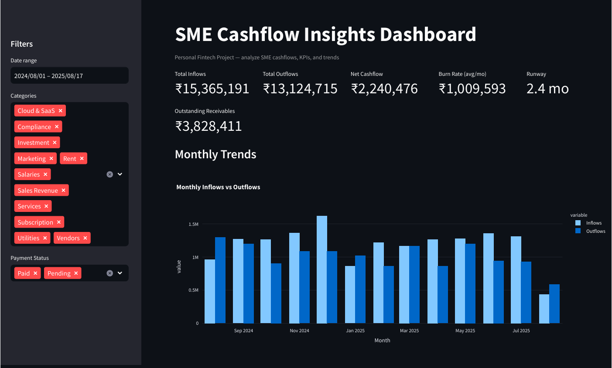
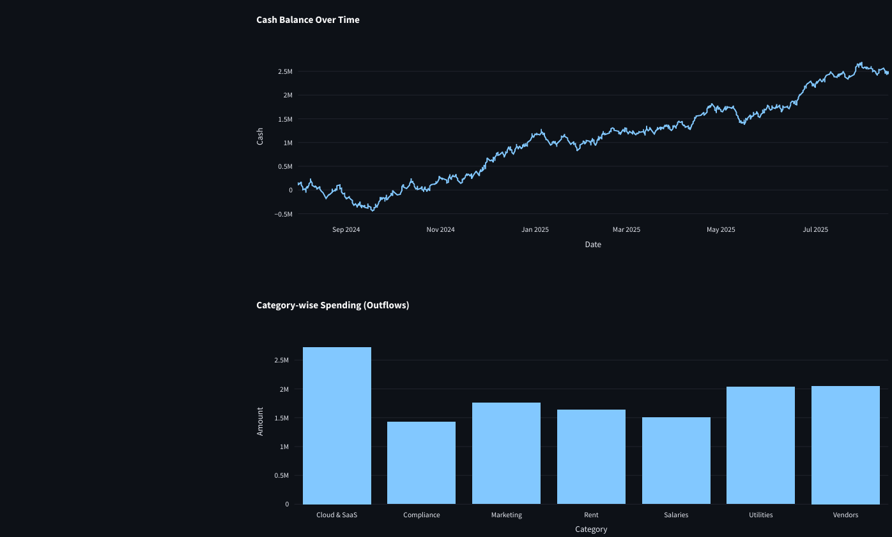
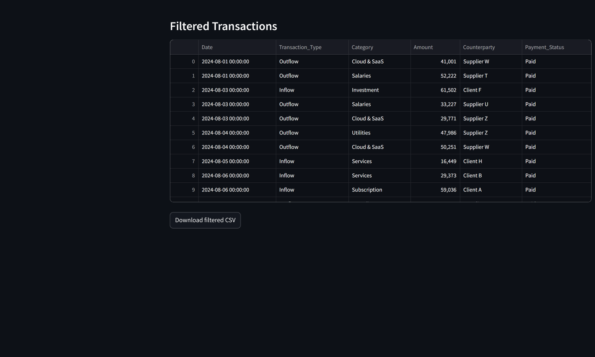

# 💳 SME Cashflow Insights Dashboard

An interactive **Fintech Analytics Dashboard** built with **Streamlit** to simulate SME (Small & Medium Enterprise) transactions, compute financial KPIs, and visualize cashflows.  
This project was designed as a **portfolio project** to showcase data-driven product thinking for fintech.

---

## 🚀 Features
- **Synthetic SME transaction dataset** (inflows, outflows, receivables).
- **KPIs:** Inflows, Outflows, Net Cashflow, Burn Rate, Runway, Outstanding Receivables.
- **Visualizations:**  
  - Monthly inflows vs outflows  
  - Cash balance over time  
  - Category-wise spending  
- **Filters:** Date range, category, payment status.
- **Export:** Download filtered data as CSV.

---

## 🛠️ Tech Stack
- Python 3.13  
- Streamlit 1.38.0  
- Pandas 2.2.3  
- Numpy 2.1.3  
- Plotly 5.23.0  

## 📊 Screenshots

Here’s a preview of the dashboard in action:





## ⚡ Quickstart


Create and activate virtual environment:
```bash
python -m venv .venv
# Windows PowerShell
.\.venv\Scripts\Activate.ps1
```

Install dependencies:
```bash
pip install -r requirements.txt
```

Run the dashboard:
```bash
streamlit run app.py
```

---

## 🎯 Future Improvements
- Connect to **real accounting APIs** (e.g., QuickBooks, Xero).  
- Add **user authentication** for multi-company dashboards.  
- Build **alerts** for low runway or delayed receivables.  

---

## 📌 About This Project
This project was created to demonstrate **data-driven product development** in the fintech domain.  
It combines **engineering (Python, ML tools)** with **business insights (KPIs for SMEs)**.  
